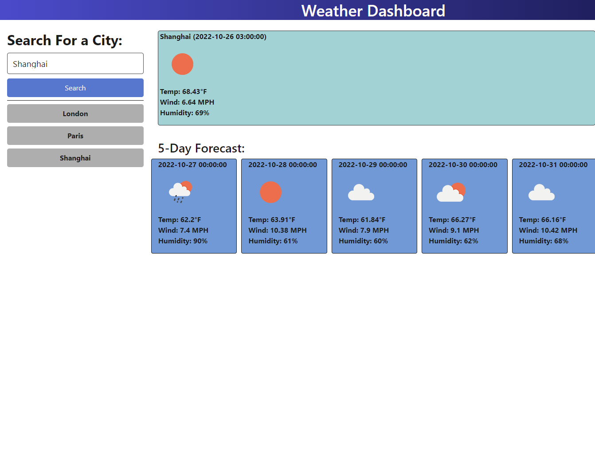

# module-6-challenge

## Description

The purpose of Module 6 Challenge was to create a weather forecast dashboard app. We were to use our newly learned knowledge of server side APIs, along with everything else we've learned so far, to create this dashboard, where the user can search for the current weather and a 5 day forecast of the location of their choice.

## Installation

N/A

## Usage

The user can type a city name into the search bar and click search to get the results. The current weather will display in the jumbotron, and the forcast for the next 5 days will display in the cards below. The searched location will appear below the search form as a button. The app is very responsive.

There are currently a number of significant fixes to be made:
1. The 5 day forecast does not show the forecast for 12 noon
2. The previously searched location buttons do not do anything
3. The previously searched location buttons can be duplicates
4. The previously searched location buttons do not persist when the page is refreshed
5. The jumbotron and 5 day forecast cards are present but empty before a search is made

Screenshot: 

URL: [https://annhixson.github.io/module-6-challenge/](https://annhixson.github.io/module-6-challenge/)

## Credits
 - reset.css copied from the provided solution of mini-project-6 jass.css
 - AskBCS Learning Assistant John (jguzzetta) provided part of the lines with comments that AskBCS assisted (`date1 = data.list[1 * 8 - 1].dt_txt;`)
 - API used for weather data is [https://openweathermap.org/forecast5](https://openweathermap.org/forecast5)
 - API used for geocoding is [https://openweathermap.org/api/geocoding-api](https://openweathermap.org/api/geocoding-api)

 ## License

 N/A
